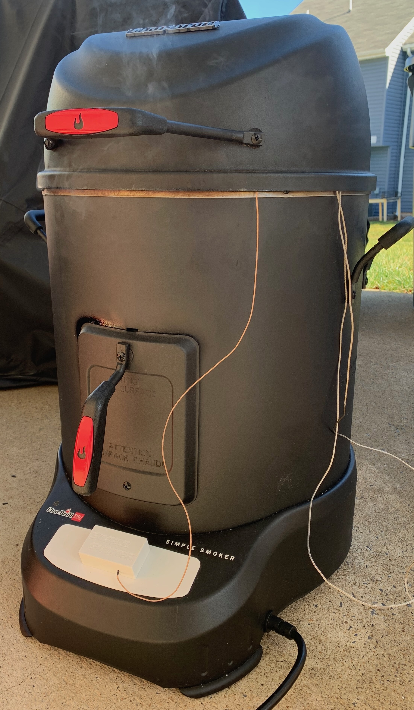
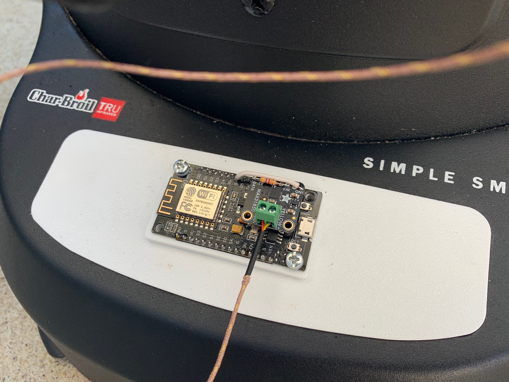
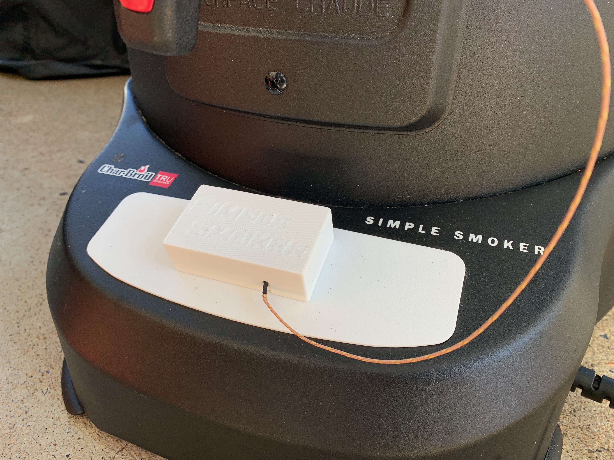
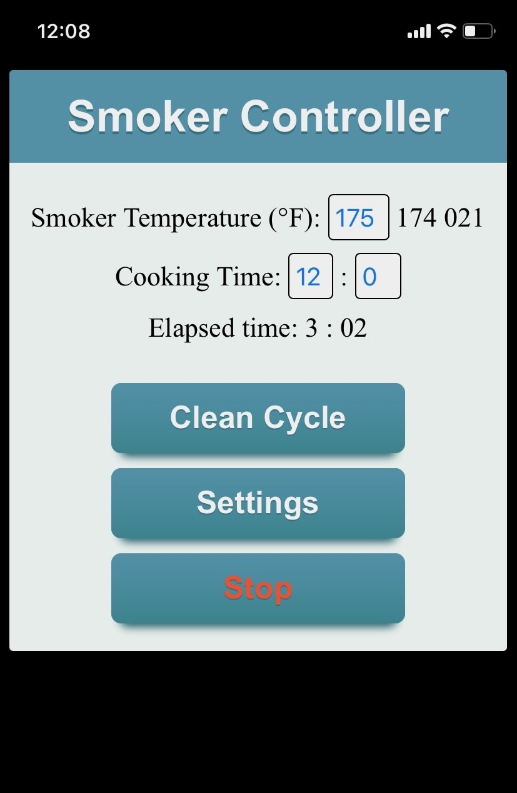
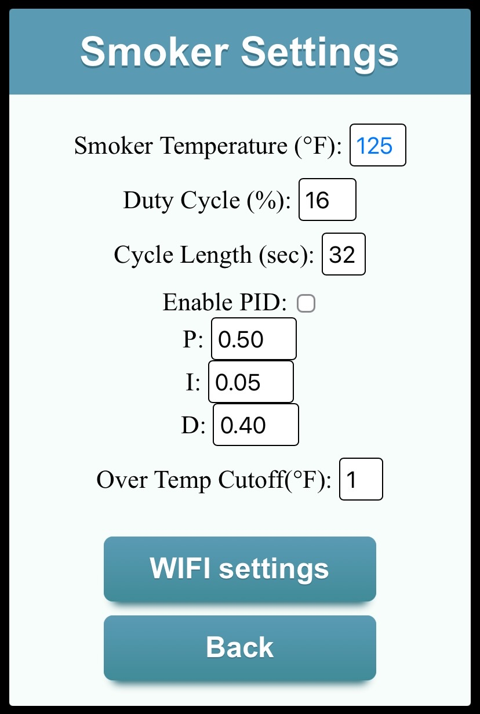
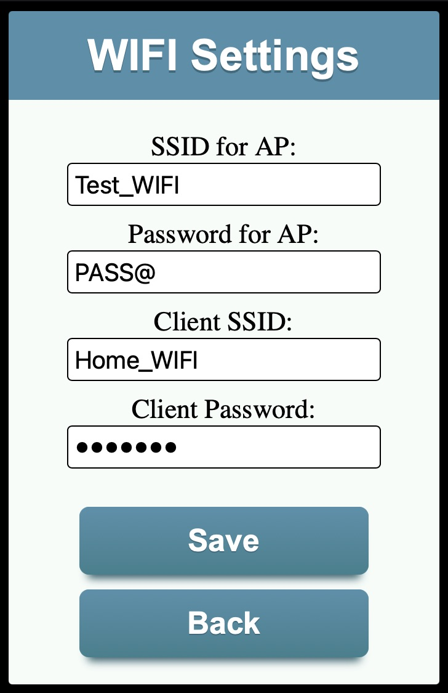

# Controller for Charbroil Simple Smoker

My smoker had random issues connecting to the phone app, which is how this project started. 

The original controller uses a PWM signal with a preset duty cycle to control the smoker's temperature. I recreated this functionality in the code and also added the option to integrate a thermocouple for better temperature control using PID. For this, I got a MAX31850K thermocouple amplifier and a Type-K thermocouple with a stainless steel tip from adafruit.com.

##  Hardware Components
* **Microcontroller:** Compatible with either the **Arduino Nano ESP32** (ESP32-S3) or **NodeMCU 1.0** (ESP8266).
* **Thermocouple Amplifier:** [Adafruit MAX31850K](https://adafruit.com) 1-Wire Type-K Amplifier.
* **Temperature Sensor:** [Adafruit Type-K Thermocouple](https://adafruit.com).
* **Power & Actuation:** Powered directly by the smoker's **existing 5V power supply**, driving the stock **heater relay** controls.

### Prerequisites
Need extra libraries installed in Arduino IDE for MAX31850 Thermocouple Amplifier:
* `MAX31850 OneWire` by Adafruit
* `MAX31850 DallasTemp` by Adafruit
* Also need to add code to OneWire.h if Arduino Nano ESP32 will be used:
  ```
    #elif defined(ARDUINO_ARCH_ESP32)
    #define PIN_TO_BASEREG(pin) ((volatile uint32_t *)((digitalPinToGPIONumber(pin)>31)?1:0))
    #define PIN_TO_BITMASK(pin) (1 << (digitalPinToGPIONumber(pin)&31))
    #define IO_REG_TYPE uint32_t
    #define IO_REG_ASM
    #define DIRECT_READ(base, mask) ((*((volatile uint32_t *)((base)?GPIO_IN1_REG:GPIO_IN_REG)) & (mask)) ? 1 : 0) // GPIO_IN_ADDRESS
    #define DIRECT_MODE_INPUT(base, mask) (*((volatile uint32_t *)((base)?GPIO_ENABLE1_W1TC_REG:GPIO_ENABLE_W1TC_REG)) = (mask)) // GPIO_ENABLE_W1TC_ADDRESS
    #define DIRECT_MODE_OUTPUT(base, mask) (*((volatile uint32_t *)((base)?GPIO_ENABLE1_W1TS_REG:GPIO_ENABLE_W1TS_REG)) = (mask)) // GPIO_ENABLE_W1TS_ADDRESS
    #define DIRECT_WRITE_LOW(base, mask) (*((volatile uint32_t *)((base)?GPIO_OUT1_W1TC_REG:GPIO_OUT_W1TC_REG)) = (mask)) // GPIO_OUT_W1TC_ADDRESS
    #define DIRECT_WRITE_HIGH(base, mask) (*((volatile uint32_t *)((base)?GPIO_OUT1_W1TS_REG:GPIO_OUT_W1TS_REG)) = (mask)) // GPIO_OUT_W1TS_ADDRESS
  ```

### Wiring Diagram

Both microcontrollers operate natively on **3.3V logic** but interface cleanly with the smoker's 5V power supply. Ensure you add a **4.7kΩ pull-up resistor** between the MAX31850K `DATA` line and the `3.3V` pin.

#### Option A: Using Arduino Nano ESP32

| Target Component | Nano ESP32 Pin | Notes |
| :--- | :--- | :--- |
| Smoker 5V Supply | `VBUS` (or `VIN`) | Powers the microcontroller from the stock unit |
| Smoker Ground | `GND` | Common Ground reference |
| Smoker Heater Relay | `D3` | Drives the internal heater switching circuit via PWM |
| MAX31850K VCC | `3.3V` | Local 3.3V power out from the Nano |
| MAX31850K DATA| `D7` | 1-Wire Data line (Requires 4.7kΩ pull-up to 3.3V) |

#### Option B: Using NodeMCU 1.0 (ESP8266)

| Target Component | NodeMCU Pin | Notes |
| :--- | :--- | :--- |
| Smoker 5V Supply | `VIN` (or `5V`) | Powers the microcontroller from the stock unit |
| Smoker Ground | `GND` | Common Ground reference |
| Smoker Heater Relay | `D1` | Drives the internal heater switching circuit via PWM |
| MAX31850K VCC | `3V3` | Local 3.3V power out from the NodeMCU |
| MAX31850K DATA| `D7` | 1-Wire Data line (Requires 4.7kΩ pull-up to 3.3V) |

---

## 🌐 Wi-Fi Configuration & Network Modes

The controller can either connect to your **Home Wi-Fi network** or operate standalone by creating its own **Access Point (AP)**. You can manually force the device into AP mode using the onboard **Flash button** during boot-up or reset.

### Network Behavior Matrix

| Action | Resulting Mode | Network SSID | Password | IP Address |
| :--- | :--- | :--- | :--- | :--- |
| **Normal Boot** | Home Wi-Fi | *Your Home Network* | *Your Password* | Assigned by Router |
| **Press Flash Button for 3s** | Custom AP Mode | *Configured Project AP* | *Configured Pass* | `192.168.4.1` |
| **Press Flash Button for 10s**| Factory Reset AP| `smoker` | *None (Open)* | `192.168.4.1` |

<sup>On normal boot if home Wi-Fi is not configured Custom AP Wi-Fi will be started. If AP not configured open AP will be started with `smoker` SSID.</sup>
<sup>Controller will flash last three digits of assigned IP, no leading zeros. Example: 203 will be two short flashes, pause, one long flash for zero, pause, three short flashes.</sup>

### 🛠️ How to Trigger Access Point (AP) Mode
1. Power cycle or hit the **Reset** button on the microcontroller.
2. Watch for the **blue light to blink** immediately at power-up.
3. **For Custom AP:** On NodeMCU press and hold the **Flash** button or on Nano ESP32 short pin D2 to ground for **3 seconds**.
4. **For Factory Reset AP:** On NodeMCU press and hold the **Flash** button or on Nano ESP32 short pin D2 to ground for **10 seconds**. The controller will spin up an open hotspot named `smoker`.
5. Connect your phone or computer to the Wi-Fi network and navigate to `http://192.168.4.1` in your browser to access the control panel.

---







